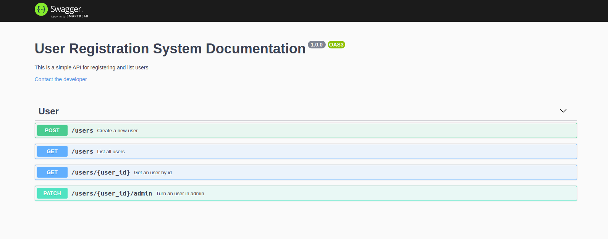

# Chapter II - Challenge 2

<h1 align="center">
    
</h1>

Rocketseat Ignite - Chapter II - Challenge 1 - Documentando com Swagger

## About

Documenting the previous application with Swagger.

<h1 align="center">
    
</h1>

To experiment, clone this repository. Use the yarn command to install the dependencies. Access on localhost:3333/api-docs.

___

By Fernando Trindade 🤓
